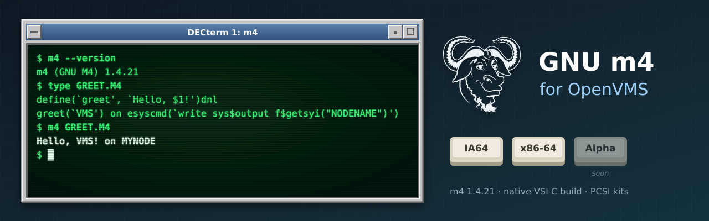

<p align="center">
  
</p>

# GNU m4 for OpenVMS

[GNU m4](https://www.gnu.org/software/m4/) (**1.4.21**), the macro processor, built natively
for OpenVMS on **IA64** and **x86-64**, following m4's own releases. GNU Bison runs m4 to
generate its parsers: [GNU Bison for OpenVMS](https://github.com/issinoho/vms-bison) uses
this m4. It belongs to the same family as
[GNU grep](https://github.com/issinoho/vms-grep), [GNU sed](https://github.com/issinoho/vms-sed),
[GNU awk](https://github.com/issinoho/vms-awk), [GNU Wget](https://github.com/issinoho/vms-wget),
[curl](https://github.com/issinoho/vms-curl), [zlib](https://github.com/issinoho/vms-zlib) and
[PCRE2](https://github.com/issinoho/vms-pcre2) for OpenVMS.

This repository holds **only our changes**: every build starts from the signed GNU release
tarball (Eric Blake's key, pinned in `keys/`), applies our patches and adds our VMS files.
As for grep, sed and Wget, m4's own `configure` runs on a Linux host with every compile and
link test sent to VSI C on the node, and MMS builds the result.

## Status

**Released: [v1.4.21-vms1](https://github.com/issinoho/vms-m4/releases/tag/v1.4.21-vms1).**

| | IA64 (OpenVMS V8.4-2L3, VSI C 7.4) | x86-64 (OpenVMS E9.2-4, VSI C 7.7) |
|---|---|---|
| VSI C configure answers (identical on both) | yes | yes |
| Builds | yes | yes |
| Smoke test (expansion, `eval`, `include`, diversions, `syscmd`/`esyscmd` with DCL, output as lines, error status) | 9/9 | 9/9 |
| Kit install, run from the kit, remove | clean | clean |
| PCSI kit (`M4`, `V1.4-21E1`) | `ISSINOHO-I64VMS-M4-V0104-21E1-1.PCSI` | `ISSINOHO-X86VMS-M4-V0104-21E1-1.PCSI` |

## On VMS

- **`syscmd` and `esyscmd`** run their command as DCL in a subprocess (`LIB$SPAWN`), its
  output collected in a temporary file in `SYS$SCRATCH`:
  `esyscmd(`write sys$output f$getsyi("NODENAME")')`. `syscmd`'s output goes to m4's
  output in sequence; `sysval` is 0 after success. OpenVMS has no `fork()`, which gnulib's
  process code needs, and the C RTL's `system()`/`popen()` fail or hang when m4's output is
  redirected to a file (patch 0007).
- **Exit status.** Under DCL a failed run has error severity, so `ON ERROR` works; under a
  GNV shell, `$?` is the exit code as on Unix (patch 0005, as in vms-wget).
- **Upper-case options in batch jobs.** Under the TRADITIONAL DCL parse style unquoted
  options reach m4 in lower case: `-D` (define) becomes `-d` (debug). Quote them
  (`"-DNAME=value"`) or `$ SET PROCESS/PARSE_STYLE=EXTENDED` first.

## Installing the kit

Download the kit for your architecture from the
[latest release](https://github.com/issinoho/vms-m4/releases/latest) and check it against
the release's `SHA256SUMS`. A kit downloaded through a non-VMS system loses its record
format, so restore that first, then install it:

```
$ SET FILE/ATTRIBUTE=(RFM:FIX,LRL:8192,MRS:8192,RAT:NONE) ISSINOHO-*-M4-V0104-21E1-1.PCSI
$ PRODUCT INSTALL M4 /PRODUCER=ISSINOHO /SOURCE=dev:[dir]
$ @M4$ROOT:[000000]M4$SETUP.COM
```

It installs `[M4.BIN]M4.EXE`, `M4$SETUP.COM` (defines the `m4` command; add it to
`LOGIN.COM` or `SYLOGIN.COM`), the manual in `[M4.DOC]`, and `SYS$STARTUP:M4$STARTUP.COM`,
which defines `M4$ROOT` (add `$ @SYS$STARTUP:M4$STARTUP.COM` to
`SYS$MANAGER:SYSTARTUP_VMS.COM` to define it at every boot). `PRODUCT REMOVE M4` removes it.

## Patches

| Patch | Purpose |
|---|---|
| 0001 | `lib/dynarray.h`, `lib/scratch_buffer.h`: include the generated `*.gl.h` headers as `*_gl.h` (VSI C cannot include a name with two dots). |
| 0002 | `lib/getprogname.c`: VMS implementation. |
| 0003 | `lib/malloc/scratch_buffer.h`: avoid the member name `__align`, a VSI C keyword. |
| 0004 | `configure`: look for `struct sched_param` in `<pthread.h>` for host `openvms*`. |
| 0005 | `lib/stdlib.in.h`: route `exit()` through `vms_exit()` for an error-severity status under DCL. |
| 0006 | `lib/config.hin`: undefine VSI C's `<assert.h>` guard so `assert` comes back after gnulib's `#undef`. |
| 0007 | `src/builtin.c`: `syscmd` and `esyscmd` through `LIB$SPAWN` on VMS. |
| 0008 | `lib/*.c`: include `float+.h` as `float_plus.h` (VSI C does not find a name with `+`). |

0001-0006 are the gnulib fixes of the sed and Wget ports.

## How to build

Set up `tools/nodes.conf` as described in
[vms-grep's README](https://github.com/issinoho/vms-grep#2b-build-on-vms-from-the-host-over-ssh).

```sh
git clone https://github.com/issinoho/vms-m4.git
cd vms-m4
tools/vms_configure.sh ia64 # VSI C configure run, about an hour (once per m4 release)
tools/prepare.sh            # fetch + verify, patch, configure with the VSI C answers, MMS lists
tools/build.sh ia64         # upload, then @[.VMS]BUILD on the node (MMS)
tools/test.sh ia64          # smoke test
tools/kit.sh ia64           # PCSI kit -> out/kits/
```

## Roadmap

1. m4's own test suite under GNV, as for grep and sed.
2. Offer patch 0007 (`syscmd`/`esyscmd` on VMS) to m4, and the gnulib fixes to gnulib.
3. A port to OpenVMS **Alpha**.

The family of ports, all for IA64 and x86-64, each following its upstream releases:

| Port | Latest release | |
|---|---|---|
| GNU grep — [vms-grep](https://github.com/issinoho/vms-grep) | [v3.12-vms3](https://github.com/issinoho/vms-grep/releases/tag/v3.12-vms3) | with `grep -P` through PCRE2 |
| PCRE2 — [vms-pcre2](https://github.com/issinoho/vms-pcre2) | [v10.49-vms1](https://github.com/issinoho/vms-pcre2/releases/tag/v10.49-vms1) | the regular-expression library |
| GNU sed — [vms-sed](https://github.com/issinoho/vms-sed) | [v4.10-vms1](https://github.com/issinoho/vms-sed/releases/tag/v4.10-vms1) | the stream editor |
| GNU awk (gawk) — [vms-awk](https://github.com/issinoho/vms-awk) | [v5.4.1-vms1](https://github.com/issinoho/vms-awk/releases/tag/v5.4.1-vms1) | built with gawk's own VMS port |
| zlib — [vms-zlib](https://github.com/issinoho/vms-zlib) | [v1.3.2-vms1](https://github.com/issinoho/vms-zlib/releases/tag/v1.3.2-vms1) | the compression library |
| curl — [vms-curl](https://github.com/issinoho/vms-curl) | [v8.22.0-vms1](https://github.com/issinoho/vms-curl/releases/tag/v8.22.0-vms1) | alongside VSI's curl kit, following curl's own releases |
| GNU Wget — [vms-wget](https://github.com/issinoho/vms-wget) | [v1.25.0-vms2](https://github.com/issinoho/vms-wget/releases/tag/v1.25.0-vms2) | the web retriever |
| **GNU m4** (this port) — [vms-m4](https://github.com/issinoho/vms-m4) | [v1.4.21-vms1](https://github.com/issinoho/vms-m4/releases/tag/v1.4.21-vms1) | the macro processor |
| GNU Bison — [vms-bison](https://github.com/issinoho/vms-bison) | [v3.8.2-vms2](https://github.com/issinoho/vms-bison/releases/tag/v3.8.2-vms2) | runs GNU m4 |
| flex — [vms-flex](https://github.com/issinoho/vms-flex) | [v2.6.4-vms1](https://github.com/issinoho/vms-flex/releases/tag/v2.6.4-vms1) | the scanner generator; runs GNU m4 |
| GNU make — [vms-make](https://github.com/issinoho/vms-make) | [v4.4.1-vms1](https://github.com/issinoho/vms-make/releases/tag/v4.4.1-vms1) | built with make's own VMS port |

## Artwork

`docs/images/banner.svg` and `docs/images/icon.svg` were made for this project in the style
of classic DECwindows and VT terminals, like those of its sibling ports. The GNU head is by
Aurelio A. Heckert, used under the terms on <https://www.gnu.org/graphics/heckert_gnu.html>.

## Licence

GNU m4 is free software under the GNU General Public License, version 3 or later; see
`COPYING`. Our patches and VMS files are distributed under the same terms.

OpenVMS is a trademark of VMS Software, Inc. This project is not affiliated with VMS
Software, Inc. or with the GNU project.
